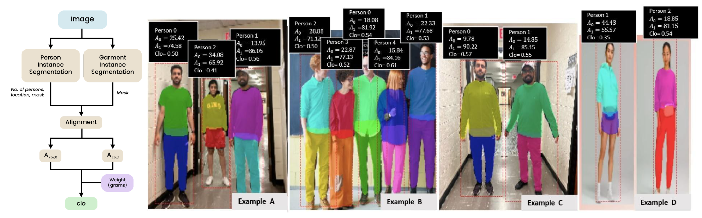

# Garment Segmentation for Clothing Insulation Estimation
Course Project for CS543 @ UIUC

## Introduction
Individual occupant thermal comfort feedback is important for building control systems toward energy savings and occupant satisfaction, well-being, and productivity. To predict individual occupant thermal comfort in an automated way, data-driven approaches have been proposed. They are based on factors affecting thermal comfort. Among these factors, clothing insulation (one of the main factors affecting thermal comfort) is often ignored and assumed constant. This project aims to propose an approach for automated clothing insulation based on garment (clothing layer) segmentation and the percentage of the area covered and not covered by garments. The approach is based on a Mask-RCNN and a mathematical equation that relates thermal comfort with the percentage of the body that is covered by area and garment weights. The Mask-RCNN was trained on the DeepFashion dataset for garment instance segmentation. The experimental tests showed the proposed approach  could achieve comparable performance to that provided in existing tables. The proposed approach can be used to support occupant thermal comfort prediction in an automated way.

## Garment Instance Segmentation Model Performance
|  Trainable Layers    | Backbone       |   mAP |   IoUmask |   IoUmask@0.5 |
| :---: | :--------------: | :----: | :--------: | :-----------: |
|    0 | ResNet50-FPN    | 0.666 |     0.725 |        0.731 |
|    3 | ResNet50-FPN    | 0.735 |     0.727 |        0.731 |
|    5 | ResNet50-FPN    | 0.719 |     0.73  |        0.735 |
|    0 | ViT             | 0.694 |     0.728 |        0.733 |
| <ins>**3**</ins> | <ins>**ViT**</ins>     | <ins>**0.746**</ins> | <ins>**0.733**</ins> | <ins>**0.737**</ins> |
|    0 | MobileNet v2    | 0.728 |     0.717 |        0.719 |
|    3 | MobileNet v2    | 0.73  |     0.714 |        0.715 |
|    5 | MobileNet v2    | 0.724 |     0.704 |        0.706 |
|    0 | SqueezeNet 1.1  | 0.646 |     0.687 |        0.689 |
|    3 | SqueezeNet 1.1  | 0.649 |     0.687 |        0.689 |
|    5 | SqueezeNet 1.1  | 0.643 |     0.688 |        0.691 |
|    0 | ResNet18        | 0.711 |     0.714 |        0.717 |
|    3 | ResNet18        | 0.713 |     0.7   |        0.702 |
|    5 | ResNet18        | 0.724 |     0.701 |        0.703 |

